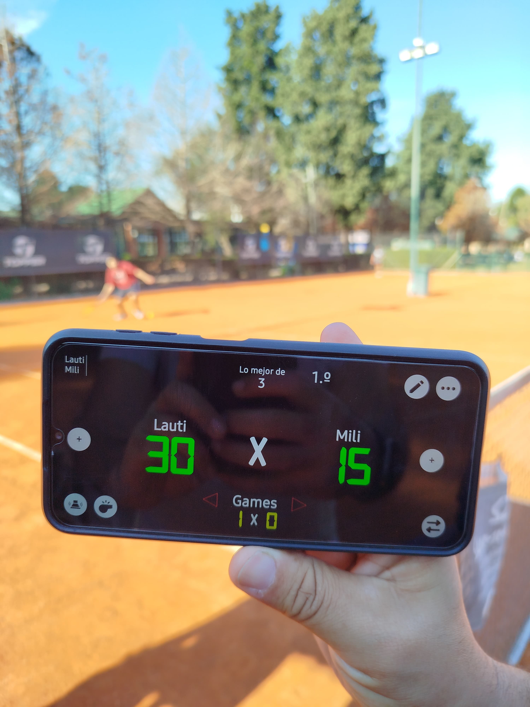

# 🎾 Torneo de Tenis UNaB 2025

Este proyecto es una **página web interactiva** que muestra los resultados y análisis de datos del **Primer Torneo de Tenis de la Universidad Nacional de Guillermo Brown (UNaB)**, realizado como iniciativa deportiva y académica.



---

## 📌 **Descripción**

El objetivo del proyecto fue **organizar, analizar y visualizar los datos** generados durante el torneo, integrando:

- Resultados de los partidos.
- Ranking y estadísticas de los jugadores.
- Visualizaciones comparativas y demográficas con **Plotly**.
- Información de los participantes y podios.

Inicialmente, el proyecto fue desarrollado en **Python con Streamlit** (ver `main.py`) pero debido a la necesidad de mayor personalización en estilos y diseño, se implementó la versión final con **HTML, CSS y JavaScript puro**.

---

## 🚀 **Tecnologías utilizadas**

- **HTML5** para la estructura de la página.
- **CSS3** con diseño responsive y estilos personalizados.
- **JavaScript (Plotly.js)** para generación de gráficos dinámicos.
- **Python (Jupyter Notebook)** para el análisis exploratorio de datos y generación de gráficos exportables.
- **Streamlit** (versión inicial del proyecto).

---

## 🗂️ **Estructura del proyecto**

```

├── asset
│   ├── script.js
│   └── style.css
├── data
│   ├── estudiantes.csv
│   └── resultados.csv
├── images
│   ├── Sebas.jpg
│   ├── ganador1_grupoA.jpeg
│   ├── ganador1_grupoB.jpeg
│   ├── ganador2_grupoA.jpeg
│   ├── ganador2_grupoB.jpeg
│   ├── ganador3_grupoA.jpeg
│   ├── ganador3_grupoB.jpeg
│   ├── tenis.png
│   ├── tenis_promo.jpg
│   ├── unab_logo.png
│   ├── unab_logo2.png
│   ├── unab_logo3.jpg
│   └── unab_logo_blanco.png
├── notebook
│   ├── output
│   │   ├── fig1.html
│   │   ├── fig2.html
│   │   ├── fig3.html
│   │   ├── fig4.html
│   │   ├── fig5.html
│   │   └── fig6.html
│   ├── analisis_exploratorio_datos.html
│   └── analisis_exploratorio_datos.ipynb
├── index.html
├── main.py
└── requirements.txt

```

---

## 📊 **Funciones principales**

✅ Visualización de rankings y estadísticas por grupo.  
✅ Tablas interactivas con resultados por jornada.  
✅ Gráficos comparativos generados con Plotly.  
✅ Responsive Design para correcta visualización en dispositivos móviles y desktop.  
✅ Exportación y reutilización de gráficos generados en Jupyter Notebook.

---

## 📝 **Instalación y ejecución (versión Python)**

Si deseas correr la versión inicial con Streamlit:

1. Clonar el repositorio.

2. Instalar dependencias:

```bash
pip install -r requirements.txt
````

3. Ejecutar:

```bash
streamlit run main.py
```

---

## 🌐 **Visualización en producción**

Actualmente, la versión web está desplegada en **Netlify**:

🔗 [Ver página en Netlify](https://1-torneo-tenis-unab.netlify.app/)

---

## 🙌 **Autor**

👤 **Sebastián Sánchez Bentolila**
Estudiante de Ciencia de Datos en UNaB

* 🔗 [LinkedIn](https://www.linkedin.com/in/sebastian-sanchez-bentolila/)
* 💻 [GitHub](https://github.com/Sebastian-Sanchez-Bentolila)

---

⭐ **Si te sirvió como inspiración o aprendizaje, no dudes en darle una estrella al repositorio y seguir mi trabajo.**

Si te resultó útil, no dudes en dejar una estrella ⭐ en el repositorio y seguir mi trabajo para más dashboards y aplicaciones de datos.
